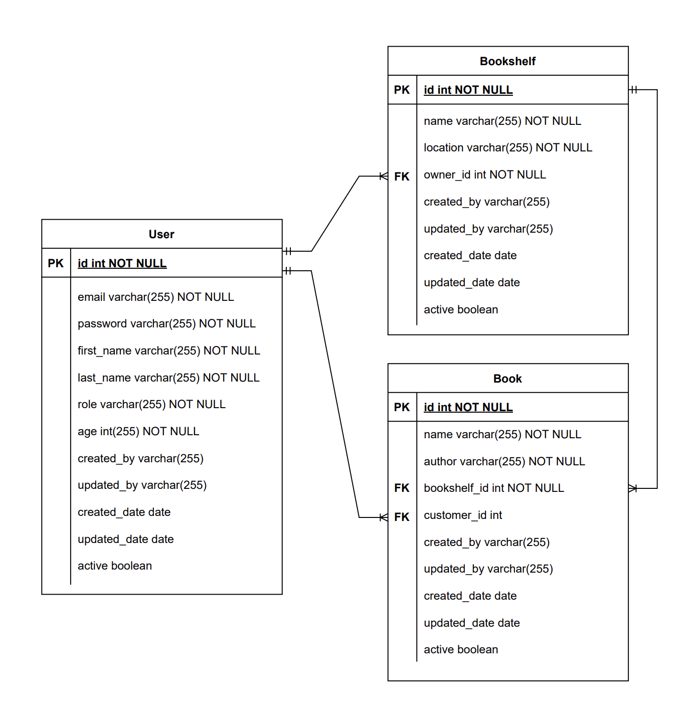
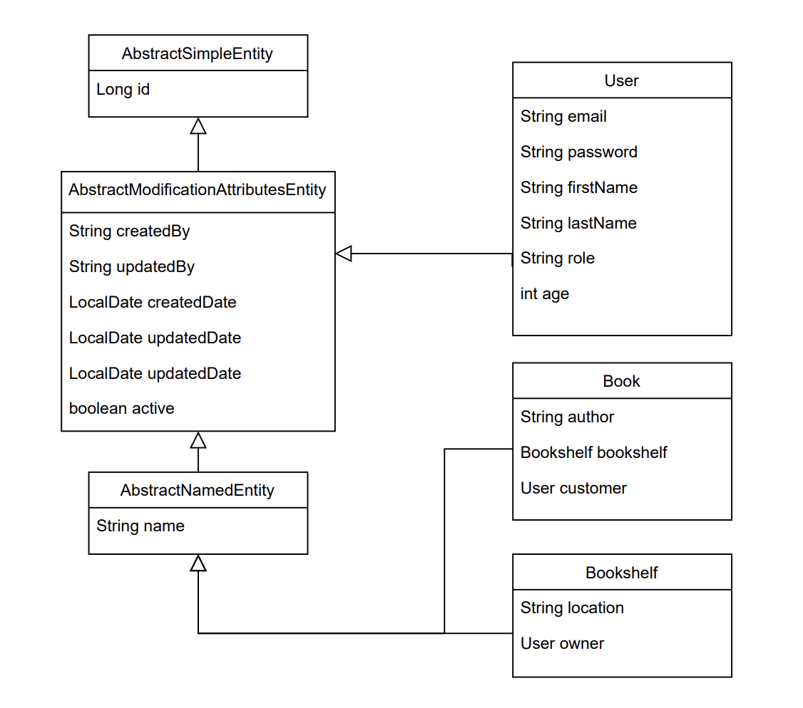

# Spring Book
Rest API for Spring Book
<br><br>

## Requirements

For building and running the application you need:

- [JDK 11.0](https://www.oracle.com/mx/java/technologies/javase/jdk11-archive-downloads.html)
- [Maven 3](https://maven.apache.org)
## Running the application locally

There are several ways to run a Spring Boot application on your local machine. One way is to execute the `main` method in the `dev.ososuna.springbook.SpringBookApplication` class from your IDE.

Alternatively you can use the [Spring Boot Maven plugin](https://docs.spring.io/spring-boot/docs/current/reference/html/build-tool-plugins-maven-plugin.html) like so:

```shell
mvn spring-boot:run
```
## Try it out with Docker

First, build the application:

```shell
mvn package
```

Then you need to build the Docker image:

```shell
docker build -t spring-book-api .
```
  
Now you can run the image:
  
```shell
docker run --name spring-book-api -p 3001:3001 spring-book-api
```
## Entity Relationship Diagram


## Class Diagram

