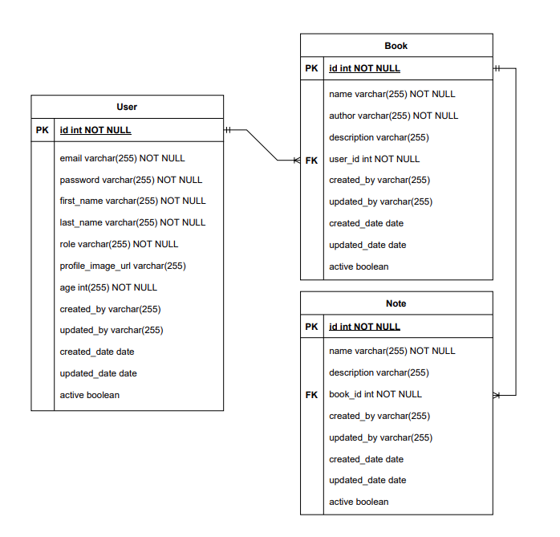
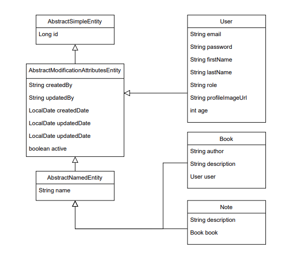

# My Library API
Rest API for My Library
<br><br>

## Requirements

For building and running the application you need:

- [JDK 11.0](https://www.oracle.com/mx/java/technologies/javase/jdk11-archive-downloads.html)
- [Maven 3](https://maven.apache.org)
## Running the application locally

There are several ways to run a Spring Boot application on your local machine. One way is to execute the `main` method in the `dev.ososuna.mylibrary.MyLibraryApplication` class from your IDE.

Alternatively you can use the [Spring Boot Maven plugin](https://docs.spring.io/spring-boot/docs/current/reference/html/build-tool-plugins-maven-plugin.html) like so:

```shell
mvn spring-boot:run
```
## Entity Relationship Diagram


## Class Diagram

